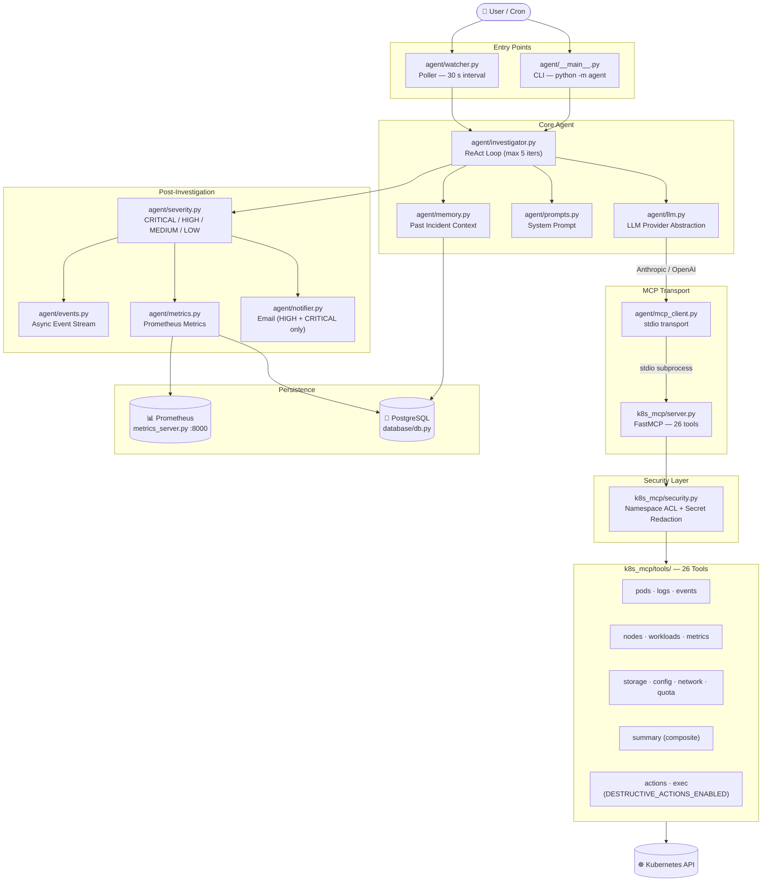

# KubeSherlock — Project Overview

AI-powered Kubernetes incident investigation agent. Automatically detects pod failures and generates root-cause analysis reports using Claude (Anthropic) or GPT (OpenAI) via a ReAct reasoning loop over 26 Kubernetes diagnostic tools.

---

## Table of Contents

1. [What the Project Does](#what-the-project-does)
2. [Architecture Diagram](#architecture-diagram)
3. [Directory Structure](#directory-structure)
4. [File-by-File Breakdown](#file-by-file-breakdown)
5. [Existing Docs Map](#existing-docs-map)
6. [Configuration Summary](#configuration-summary)
7. [Quick Start](#quick-start)

---

## What the Project Does

Three modes of operation:

- **Single investigation** — ask "Why is my pod crashing?" → get an AI root-cause report
- **Continuous watcher** — polls namespaces every 30 s, auto-detects failures, triggers investigations, emails HIGH/CRITICAL alerts
- **MCP server standalone** — exposes 26 Kubernetes tools over the Model Context Protocol (stdio), usable by any MCP-compatible client

Optional production features: PostgreSQL investigation history, Prometheus metrics endpoint.

---

## Architecture Diagram



---

## Directory Structure

```
kubesherlock/
├── agent/                  # AI investigation agent + watcher
├── k8s_mcp/                # Kubernetes MCP server + 26 tools
│   └── tools/              # Individual tool modules
├── database/               # PostgreSQL abstraction layer
├── examples/               # Runnable usage example
├── tests/                  # pytest unit tests + html template test
├── mail/                   # Generated email preview HTML files
├── docs/                   # Documentation
│   ├── architecture/
│   ├── guides/
│   └── reference/
├── config.env              # Environment variable template (safe to commit)
├── .env                    # Your local secrets — NEVER commit
├── docker-compose.yml      # PostgreSQL + Prometheus services
├── prometheus.yml          # Prometheus scrape config
├── setup-local.sh          # One-command local setup
├── smoke_test.py           # Integration smoke test
└── NEW_FILES_MANIFEST.txt  # Delivery artifact (can be removed)
```

---

## File-by-File Breakdown

### Root Level

| File | Purpose |
|---|---|
| `readme.md` | Project intro, quick start, feature list, dev commands |
| `config.env` | Template for all environment variables, grouped and commented — safe to commit |
| `setup-local.sh` | Creates `.venv`, installs all deps, copies `config.env` → `.env` |
| `docker-compose.yml` | PostgreSQL 16 (port 5432) + Prometheus (port 9090) |
| `prometheus.yml` | Prometheus scrape config → `metrics_server.py` on port 8000 |
| `smoke_test.py` | Integration test: spins up MCP server, runs 14 tool checks, reports pass/fail |
| `NEW_FILES_MANIFEST.txt` | Delivery artifact — can be deleted |

---

### `mail/` — Email Previews

Generated by `tests/test_html_template.py`. Not source — covered by `.gitignore`.

| File | Severity Preview |
|---|---|
| `email_preview_critical.html` | CRITICAL — red badge |
| `email_preview_high.html` | HIGH — orange badge |
| `email_preview_medium.html` | MEDIUM — yellow badge |
| `email_preview_low.html` | LOW — cyan badge |

---

### `agent/` — AI Investigation Agent

| File | What's Written There |
|---|---|
| `__main__.py` | CLI entrypoint. Parses `question`, `--provider`, `--model`, `--namespaces`, `--destructive`. Spawns MCP server subprocess, runs `Investigator`. |
| `investigator.py` | ReAct loop (max 5 iters). LLM → parse tool calls → execute via MCPClient → feed results back → repeat until final answer or max iters. |
| `watcher.py` | Continuous poller. Detects `CrashLoopBackOff`, `OOMKilled`, `ImagePullBackOff` etc., applies cooldown (300 s), triggers Investigator, optionally emails. |
| `llm.py` | Wraps Anthropic + OpenAI SDKs behind a unified `LLMProvider` interface. |
| `mcp_client.py` | `run_with_mcp(server_cmd, callback)` — launches MCP server as subprocess, returns `MCPClient` with `.tools` and `.call_tool()`. |
| `prompts.py` | `SYSTEM_PROMPT` — instructs LLM on role, tool strategy (start with `summarize_pod_health`), output format. |
| `severity.py` | `detect_severity(result, failure)` — rule-based, checks failure reason + LLM answer text for keywords → `CRITICAL/HIGH/MEDIUM/LOW`. |
| `notifier.py` | `EmailConfig` (from env) + `EmailNotifier`. Sends multipart HTML/plain email via SMTP, 3-attempt exponential backoff. |
| `memory.py` | Queries PostgreSQL for past investigations in same namespace/pod, formats them as context injected into system prompt. |
| `metrics.py` | In-memory counters (investigation count, duration, tool calls, errors). Optionally persists to PostgreSQL. |
| `events.py` | Async pub/sub stream. `EventType` enum: `POD_FAILURE_DETECTED`, `INVESTIGATION_STARTED/COMPLETED/FAILED`, `TOOL_CALLED`, `METRIC_RECORDED`. |
| `metrics_server.py` | FastAPI app, `/metrics` endpoint in Prometheus text format. Run via `python -m agent.metrics_server`. |
| `integration.py` | `MonitoringComponents` — bundles Database + Memory + MetricsCollector + EventStream for single-call init. |
| `requirements.txt` | `anthropic`, `openai`, `mcp`, `anyio`, `python-dotenv`, `kubernetes`, `asyncpg`, `fastapi`, `uvicorn`, `prometheus-client` |

---

### `k8s_mcp/` — Kubernetes MCP Server

| File | What's Written There |
|---|---|
| `server.py` | FastMCP server. Registers all 26 tools with `@mcp.tool()`. Parses `--namespaces`, constructs `SecurityContext`, serves over stdio. |
| `client.py` | `K8sClient` singleton — lazy-initialises `CoreV1Api`, `AppsV1Api`, `CustomObjectsApi` from kubeconfig. |
| `security.py` | `check_namespace(ns)` raises `PermissionError` if not in allowlist. `redact(data)` replaces values of keys matching `*KEY/*TOKEN/*PASSWORD/*SECRET` with `***REDACTED***`. |
| `logging_config.py` | File logging to `/tmp/kubesherlock_mcp.log`. |

#### `k8s_mcp/tools/`

| File | Tools |
|---|---|
| `pods.py` | `list_pods`, `describe_pod` |
| `logs.py` | `get_pod_logs` (500-line cap), `get_all_container_logs` (all containers + init + previous) |
| `events.py` | `get_events` (warnings_only filter) |
| `nodes.py` | `list_nodes`, `describe_node` |
| `workloads.py` | `list_deployments`, `list_statefulsets` |
| `metrics.py` | `get_pod_metrics`, `get_node_metrics` (requires metrics-server) |
| `storage.py` | `list_pvcs`, `describe_pvc` |
| `config.py` | `list_configmaps`, `get_configmap` (redacted) |
| `network.py` | `list_services`, `describe_service` |
| `quota.py` | `list_resource_quotas` (flags ≥80% usage), `list_limit_ranges` |
| `summary.py` | `summarize_pod_health` — composite: pod + logs + events + node + PVC + quota + workload + metrics + probable causes. **Call this first.** |
| `actions.py` | `restart_pod`, `delete_pod`, `restart_deployment`, `scale_deployment`, `rollback_deployment` — gated by `DESTRUCTIVE_ACTIONS_ENABLED` |
| `exec.py` | `exec_in_pod` — gated by same flag |

---

### `database/`

| File | What's Written There |
|---|---|
| `db.py` | `Database` singleton. `asyncpg` pool. `save_investigation`, `search_investigations`, `save_metric`, `get_metrics_summary`. Degrades gracefully if Postgres unreachable. |
| `schema.sql` | `investigations` table (id, namespace, pod, question, answer, tool_calls JSON, iterations, provider, severity) + `metrics` table. |
| `requirements.txt` | `asyncpg==0.30.0` |

---

### `tests/`

| File | What's Tested |
|---|---|
| `test_k8s_mcp.py` | All tool classes with mocked K8s API — pods, logs, events, nodes, workloads, metrics, storage, config, network, quota, summary |
| `test_notifier.py` | `EmailNotifier` — config loading, email building, SMTP send, retry logic |
| `test_severity.py` | `detect_severity` — all four levels across reason/answer combinations |
| `test_watcher_email_integration.py` | 7 integration tests — watcher + email: config, notifier init, alert triggering, severity gating |
| `test_html_template.py` | Generates `mail/email_preview_*.html` for all 4 severities |

---

### `docs/`

| File | Audience | Key Content |
|---|---|---|
| `EMAIL_ALERTS.md` | DevOps | SMTP config, Gmail setup, integration snippet, severity table, email format, retry behaviour |
| `architecture/OVERVIEW.md` | Architects | ASCII diagram, module tables, data flow, security model, extensibility guide |
| `guides/QUICKSTART.md` | New users | Setup in 1 min, first run commands |
| `guides/TESTING.md` | Developers | All test commands, manual namespace + redaction tests, debugging tips |
| `guides/EMAIL_ALERTS_VERIFICATION.md` | DevOps | Full email integration verification: watcher changes, test pod YAML, troubleshooting |
| `reference/API.md` | API users | All 26 tools with full input/output schemas |
| `reference/CONFIGURATION.md` | Operators | All env vars with defaults and examples |

---

## Existing Docs Map

```
docs/
├── EMAIL_ALERTS.md                    ← SMTP setup + severity table
├── architecture/
│   └── OVERVIEW.md                    ← ASCII diagrams + security model
├── guides/
│   ├── QUICKSTART.md                  ← Setup in 60 s
│   ├── TESTING.md                     ← Full test suite guide
│   └── EMAIL_ALERTS_VERIFICATION.md   ← Email integration walkthrough
└── reference/
    ├── API.md                         ← All 26 tool schemas
    └── CONFIGURATION.md               ← All env vars
```

---

## Configuration Summary

All config via `.env`. Use `config.env` as the template.

| Category | Key Variables |
|---|---|
| Kubernetes | `KUBECONFIG`, `KUBE_CONTEXT`, `ALLOWED_NAMESPACES` |
| LLM | `ANTHROPIC_API_KEY`, `OPENAI_API_KEY` |
| Watcher | `WATCHER_POLL_INTERVAL`, `WATCHER_NAMESPACES`, `WATCHER_RESTART_THRESHOLD`, `WATCHER_COOLDOWN`, `WATCHER_LLM_PROVIDER` |
| Email | `WATCHER_EMAIL_ENABLED`, `SMTP_HOST/PORT/USER/PASSWORD`, `ALERT_EMAIL_TO` |
| Database | `DB_HOST`, `DB_PORT`, `DB_NAME`, `DB_USER`, `DB_PASSWORD` |
| Metrics | `METRICS_PORT` (default 8000) |
| Safety | `DESTRUCTIVE_ACTIONS_ENABLED` (default `false`) |

---

## Quick Start

```bash
# 1. Setup
./setup-local.sh        # creates .venv, installs deps, copies config.env → .env
minikube start

# 2. Add your API key
echo "ANTHROPIC_API_KEY=sk-ant-..." >> .env

# 3. Run unit tests
.venv/bin/pytest tests/ -v

# 4. Single investigation
python -m agent "Why is coredns crashing?" --namespaces kube-system

# 5. Continuous watcher
python -m agent.watcher

# 6. Optional: history + metrics
docker-compose up -d
python -m agent.metrics_server
```
