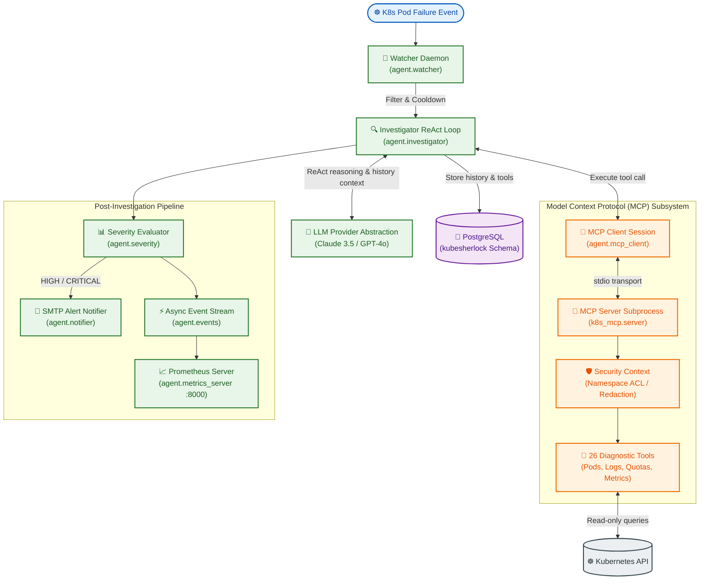

# KubeSherlock: Production-Grade AI SRE Agent for Kubernetes Incident Response

KubeSherlock is an autonomous AI Site Reliability Engineering (SRE) agent designed to detect, diagnose, and suggest remediation steps for Kubernetes pod failures. Rather than relying on simple heuristics, KubeSherlock runs an active **ReAct (Reasoning and Acting) loop** over **26 native Kubernetes diagnostic tools** using the **Model Context Protocol (MCP)**. It assess incident severity, registers Prometheus metrics, stores structured history in a dedicated PostgreSQL schema, and triggers real-time HTML email alerts for critical issues.

---

## 🏗️ System Architecture

---

## 🌟 Key Technical Accomplishments

### 1. Model-Agnostic ReAct Loop & Provider Abstraction
KubeSherlock abstracts LLM SDK details entirely behind a clean provider interface (`agent/llm.py`). It dynamically supports **Anthropic (Claude 3.5 Sonnet)** and **OpenAI (GPT-4o)**. The core `Investigator` orchestrates the reasoning chain without knowing which model is executing the requests:
* **JSON Schema Translation**: Automatically converts standard MCP tool schemas into OpenAI function calling format at runtime.
* **OpenAI Multi-Tool Calls**: Flattens and injects parallel tool results into the chat history back to the model seamlessly.

### 2. Multi-Layer Security & Hardened Sandbox
AI agents in production demand strict guardrails. KubeSherlock enforces security at the boundary:
* **Namespace ACL**: The `SecurityContext` enforces an allowed namespace list at the tool-execution level. Any attempt by the LLM to access an unlisted namespace immediately returns a local `PermissionError`, blocking access.
* **Sensitive Data Redaction**: Automatically filters tool outputs (ConfigMaps, logs, environment variables) using pattern matching to replace API keys, tokens, passwords, and SMTP secrets with `***REDACTED***` before sending them to the LLM.
* **Destructive Action Gating**: Destructive capabilities (scaling, deleting, restarting resources) are entirely separated and hard-gated by a boolean flag.

### 3. PostgreSQL Schema Isolation & Clean Hydration
Instead of polluting the `public` schema, the persistence layer utilizes a dedicated `kubesherlock` schema. 
* **Session search_path Pinned**: Pinned at pool-creation time via `server_settings={"search_path": schema}` in `asyncpg`. This avoids manual prefixing in SQL queries while guaranteeing complete database isolation.
* **Two-Phase Write Flow**: Supports writing initial investigation states upon failure detection, and dynamically updating the record with the final AI root cause and recommended actions when the ReAct loop concludes.

### 4. Prometheus Metrics & Sidecar Architecture
The agent records operational metrics (investigations count, success/error rates, average tool execution time) to both PostgreSQL and an in-memory collector.
* **Metrics Sidecar**: A companion container runs alongside the watcher, exposing a FastAPI `/metrics` endpoint.
* **Helm Integration**: Packaged with a production Helm chart featuring configurable CPU/Memory requests/limits, ServiceMonitors for Prometheus Operator, and a lightweight `test-stack.yaml` for testing local deployments.

---

## 📈 Quality Assurance & Testing Metrics

To guarantee reliability in high-pressure production environments, KubeSherlock includes a comprehensive test suite of **235 automated tests** (covering mock unit paths and live integration smoke tests):

* **100% Mocked Core Logic**: Standard libraries, async pg pools, SMTP servers, and LLM APIs are mocked out to run cleanly in local CI pipelines without external dependencies.
* **Extended Tool Coverage**: Tests validation for node pressures, volume bound/unbound states, resource limit parsing, and CLI command validation.
* **Strict Regressions**: All tests run under pytest, outputting 0 warnings and zero failures.
