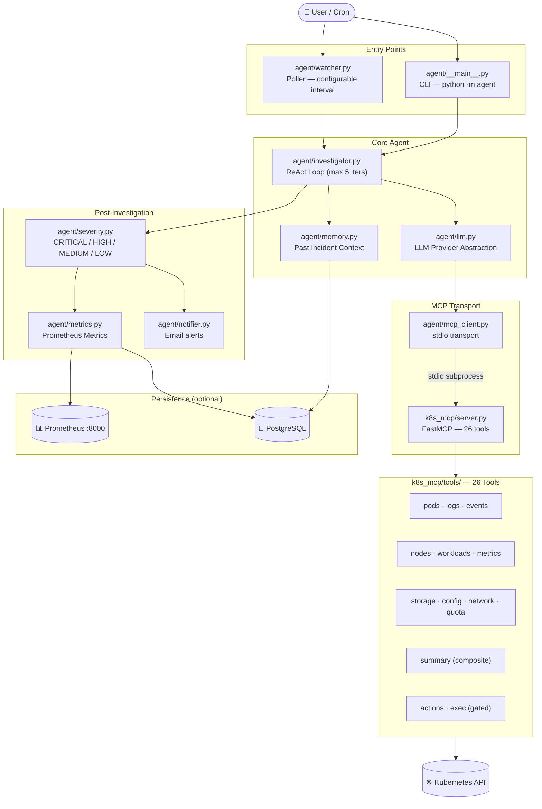

# 🔍 KubeSherlock

> **AI-powered Kubernetes incident investigation agent** — automatically detects pod failures and generates detailed root-cause analysis reports using Claude (Anthropic) or GPT (OpenAI).

KubeSherlock runs a [ReAct](https://arxiv.org/abs/2210.03629) reasoning loop over **26 Kubernetes diagnostic tools** exposed via the [Model Context Protocol (MCP)](https://modelcontextprotocol.io/), giving you production-grade AI incident investigation out of the box.

---

## Table of Contents

1. [What It Does](#what-it-does)
2. [Architecture](#architecture)
3. [Prerequisites](#prerequisites)
4. [Credentials Setup](#credentials-setup)
   - [LLM API Keys](#1-llm-api-keys)
   - [Email / SMTP Credentials](#2-email--smtp-credentials-optional)
   - [PostgreSQL Credentials](#3-postgresql-credentials-optional)
5. [Installation](#installation)
   - [Option A — Local Development](#option-a--local-development)
   - [Option B — Docker](#option-b--docker)
   - [Option C — Kubernetes via Helm](#option-c--kubernetes-via-helm-recommended-for-production)
6. [Helm Chart Reference](#helm-chart-reference)
   - [Values Reference](#values-reference)
   - [Secret Strategies](#secret-strategies)
7. [Configuration Reference](#configuration-reference)
8. [Usage](#usage)
9. [Project Structure](#project-structure)
10. [Security Considerations](#security-considerations)
11. [Troubleshooting](#troubleshooting)

---

## What It Does

KubeSherlock operates in three modes:

| Mode | Command | Description |
|---|---|---|
| **Single Investigation** | `python -m agent "Why is X crashing?"` | Ask a natural-language question and get an AI root-cause report |
| **Continuous Watcher** | `python -m agent.watcher` | Polls namespaces every N seconds, auto-detects failures, emails HIGH/CRITICAL alerts |
| **MCP Server (standalone)** | `python -m k8s_mcp.server` | Exposes all 26 K8s tools over stdio — usable by any MCP-compatible client |

**Detects:** `CrashLoopBackOff`, `OOMKilled`, `ImagePullBackOff`, `Pending`, `Error`, `Evicted`, and more.

**Outputs:** Severity-classified reports (`CRITICAL` / `HIGH` / `MEDIUM` / `LOW`), HTML email alerts, Prometheus metrics, and optional PostgreSQL investigation history.

---

## Architecture



---

## Prerequisites

| Requirement | Minimum Version | Notes |
|---|---|---|
| Python | 3.11+ | Required for local / Docker installs |
| Kubernetes cluster | 1.24+ | minikube, EKS, GKE, AKS, k3s, etc. |
| `kubectl` | Latest | Configured with cluster access |
| Helm | 3.x | Required for the Helm install only |
| Anthropic **or** OpenAI API key | — | At least one is required |
| metrics-server | — | Optional — enables CPU/memory metrics tools |

---

## Credentials Setup

KubeSherlock needs credentials for the LLM provider and, optionally, email (SMTP) and a database. **Never commit real credentials to version control.**

### 1. LLM API Keys

You need **at least one** of the following:

#### Anthropic (Claude)

1. Sign in at [console.anthropic.com](https://console.anthropic.com)
2. Navigate to **API Keys** → **Create Key**
3. Copy the key — it starts with `sk-ant-api03-...`

#### OpenAI (GPT)

1. Sign in at [platform.openai.com](https://platform.openai.com)
2. Navigate to **API Keys** → **Create new secret key**
3. Copy the key — it starts with `sk-proj-...`

> **Note:** The default LLM provider in `values.yaml` is **`openai`**. If you only have an Anthropic key, set `config.llmProvider: anthropic` in your Helm values or `WATCHER_LLM_PROVIDER=anthropic` in your `.env`.

---

### 2. Email / SMTP Credentials (optional)

KubeSherlock sends rich HTML email alerts for `HIGH` and `CRITICAL` severity findings. Any SMTP provider works.

#### Gmail Setup (recommended for testing)

> Gmail requires an **App Password** — not your regular account password — when 2-Step Verification is enabled.

1. Go to [myaccount.google.com/security](https://myaccount.google.com/security)
2. Enable **2-Step Verification** (required)
3. Search for **"App passwords"** → select **Mail** → **Other (Custom name)** → name it `KubeSherlock`
4. Copy the 16-character app password (e.g., `xxxx xxxx xxxx xxxx`)

| Variable | Gmail value |
|---|---|
| `SMTP_HOST` | `smtp.gmail.com` |
| `SMTP_PORT` | `587` |
| `SMTP_USER` | your full Gmail address |
| `SMTP_PASSWORD` | the 16-character App Password |
| `SMTP_FROM` | your full Gmail address |
| `SMTP_USE_TLS` | `true` |
| `ALERT_EMAIL_TO` | recipient email(s), comma-separated |

#### Other SMTP Providers

| Provider | Host | Port | TLS |
|---|---|---|---|
| SendGrid | `smtp.sendgrid.net` | `587` | `true` |
| Mailgun | `smtp.mailgun.org` | `587` | `true` |
| AWS SES | `email-smtp.<region>.amazonaws.com` | `587` | `true` |
| Outlook / Microsoft 365 | `smtp.office365.com` | `587` | `true` |

---

### 3. PostgreSQL Credentials (optional)

Used for investigation history and metrics persistence. The agent degrades gracefully if no database is configured — everything still works, but history is lost on restart.

| Variable | Default | Description |
|---|---|---|
| `DB_HOST` | `localhost` | PostgreSQL host |
| `DB_PORT` | `5432` | PostgreSQL port |
| `DB_NAME` | `kubesherlock` | Database name |
| `DB_USER` | `kubesherlock` | Database user |
| `DB_PASSWORD` | — | Database password |

Start a local PostgreSQL instance using the bundled Compose file:

```bash
docker-compose up -d
```

---

## Installation

### Option A — Local Development

```bash
# 1. Clone and setup
git clone https://github.com/prathamagrawal/KubeSherlock.git
cd KubeSherlock
./setup-local.sh          # creates .venv, installs deps, copies config.env → .env

# 2. Add your credentials to .env
#    (.env is gitignored — safe to put real keys here)
nano .env

# 3. Start your cluster
minikube start            # or point KUBECONFIG at an existing cluster

# 4. Run a single investigation
source .venv/bin/activate
python -m agent "Why is coredns crashing?" --namespaces kube-system

# 5. Or start the continuous watcher
python -m agent.watcher
```

**Minimal `.env` for local use:**

```env
# Kubernetes
KUBECONFIG=~/.kube/config
KUBE_CONTEXT=minikube
ALLOWED_NAMESPACES=default,kube-system

# LLM — pick one (or set both)
ANTHROPIC_API_KEY=sk-ant-api03-...
OPENAI_API_KEY=sk-proj-...

# Watcher
WATCHER_ENABLED=true
WATCHER_POLL_INTERVAL=60
WATCHER_NAMESPACES=default,kube-system
WATCHER_RESTART_THRESHOLD=3
WATCHER_COOLDOWN=300
WATCHER_LLM_PROVIDER=openai

# Email (set to true and fill SMTP_* below to enable)
WATCHER_EMAIL_ENABLED=false
SMTP_HOST=smtp.gmail.com
SMTP_PORT=587
SMTP_USER=you@gmail.com
SMTP_PASSWORD=xxxx xxxx xxxx xxxx
SMTP_FROM=you@gmail.com
SMTP_USE_TLS=true
ALERT_EMAIL_TO=you@gmail.com

# Logging
LOG_LEVEL=INFO
DESTRUCTIVE_ACTIONS_ENABLED=false
```

---

### Option B — Docker

**Build locally:**

```bash
docker build -t kubesherlock:latest .
```

**Or pull from Docker Hub:**

```bash
docker pull prathamagrawal/kubesherlock:1.0.0
```

**Run the continuous watcher:**

```bash
docker run -d \
  --name kubesherlock \
  -v ~/.kube/config:/home/kubesherlock/.kube/config:ro \
  -e ANTHROPIC_API_KEY=sk-ant-api03-... \
  -e ALLOWED_NAMESPACES=default,production \
  -e WATCHER_POLL_INTERVAL=60 \
  -e WATCHER_LLM_PROVIDER=anthropic \
  -e WATCHER_EMAIL_ENABLED=false \
  prathamagrawal/kubesherlock:1.0.0
```

**Run a one-time investigation:**

```bash
docker run --rm \
  -v ~/.kube/config:/home/kubesherlock/.kube/config:ro \
  -e OPENAI_API_KEY=sk-proj-... \
  prathamagrawal/kubesherlock:1.0.0 \
  python -m agent "Why is nginx-pod failing?" \
    --provider openai \
    --namespaces default
```

**View logs:**

```bash
docker logs -f kubesherlock
```

---

### Option C — Kubernetes via Helm (recommended for production)

#### Step 1 — Create the Kubernetes Secret

> The secret **must** be in the same namespace where you install the chart (default: `default`).

**Minimum — LLM key only:**

```bash
kubectl create secret generic kubesherlock-secrets \
  --from-literal=ANTHROPIC_API_KEY=sk-ant-api03-... \
  --from-literal=OPENAI_API_KEY=sk-proj-...
```

**With email credentials:**

```bash
kubectl create secret generic kubesherlock-secrets \
  --from-literal=ANTHROPIC_API_KEY=sk-ant-api03-... \
  --from-literal=OPENAI_API_KEY=sk-proj-... \
  --from-literal=SMTP_USER=alerts@yourdomain.com \
  --from-literal=SMTP_PASSWORD=your-app-password
```

**Verify the secret was created:**

```bash
kubectl get secret kubesherlock-secrets
kubectl get secret kubesherlock-secrets \
  -o jsonpath='{.data.ANTHROPIC_API_KEY}' | base64 -d
```

---

#### Step 2 — Install the Helm Chart

**Quickstart (OpenAI, no email):**

```bash
helm install kubesherlock ./helm/kubesherlock \
  --set secrets.existingSecret=kubesherlock-secrets \
  --set config.llmProvider=openai \
  --set "config.allowedNamespaces={default,kube-system}"
```

**With email alerts enabled:**

```bash
helm install kubesherlock ./helm/kubesherlock \
  --set secrets.existingSecret=kubesherlock-secrets \
  --set config.llmProvider=anthropic \
  --set config.emailEnabled=true \
  --set email.smtpFrom=kubesherlock@yourdomain.com \
  --set email.alertEmailTo=oncall@yourdomain.com \
  --set "config.allowedNamespaces={production,staging}"
```

**Using a custom values file (recommended):**

Create `custom-values.yaml`:

```yaml
image:
  repository: prathamagrawal/kubesherlock
  tag: "1.0.0"

replicaCount: 1

config:
  watcherEnabled: true
  watcherPollInterval: 60        # seconds between polls
  watcherRestartThreshold: 3     # restart count before triggering investigation
  watcherCooldown: 300           # seconds before re-investigating the same pod
  llmProvider: openai            # "openai" or "anthropic"
  allowedNamespaces:
    - default
    - kube-system
    - production
  logLevel: INFO
  emailEnabled: true

secrets:
  existingSecret: kubesherlock-secrets   # name of the pre-created secret

email:
  smtpHost: smtp.gmail.com
  smtpPort: 587
  smtpUseTls: true
  smtpFrom: kubesherlock@yourdomain.com
  alertEmailTo: oncall@yourdomain.com

resources:
  limits:
    cpu: 500m
    memory: 512Mi
  requests:
    cpu: 100m
    memory: 128Mi
```

```bash
helm install kubesherlock ./helm/kubesherlock -f custom-values.yaml
```

---

#### Local Testing (PostgreSQL + Prometheus)

To test the Helm deployment locally with actual database persistence and a metrics endpoint:

1. **Deploy the Test Infrastructure:**
   ```bash
   kubectl apply -f helm/test-stack.yaml
   # Wait for PostgreSQL to be ready:
   kubectl rollout status statefulset/kubesherlock-postgres
   ```
2. **Install using Test Values:**
   ```bash
   helm install kubesherlock ./helm/kubesherlock -f helm/test-values.yaml
   ```

See the [helm/kubesherlock/README.md](file:///Users/fearsomejockey/Desktop/KubeSherlock/helm/kubesherlock/README.md) for full verification steps.

---

#### Step 3 — Verify the Deployment

```bash
kubectl get pods -l app.kubernetes.io/name=kubesherlock

# Stream watcher logs
kubectl logs -f deployment/kubesherlock-kubesherlock

# Verify RBAC permissions
kubectl auth can-i list pods \
  --as=system:serviceaccount:default:kubesherlock

# Inspect the ConfigMap
kubectl get configmap kubesherlock-kubesherlock -o yaml
```

#### Upgrade

```bash
helm upgrade kubesherlock ./helm/kubesherlock -f custom-values.yaml
```

#### Uninstall

```bash
helm uninstall kubesherlock
kubectl delete secret kubesherlock-secrets
```

---

## Helm Chart Reference

### Chart Details

| Field | Value |
|---|---|
| Chart Name | `kubesherlock` |
| Chart Version | `1.0.0` |
| App Version | `1.0.0` |
| Default Image | `prathamagrawal/kubesherlock:1.0.0` |

### Values Reference

| Key | Default | Description |
|---|---|---|
| `image.repository` | `prathamagrawal/kubesherlock` | Container image repository |
| `image.tag` | `"1.0.0"` | Container image tag |
| `image.pullPolicy` | `IfNotPresent` | Image pull policy |
| `replicaCount` | `1` | Number of replicas |
| `serviceAccount.create` | `true` | Create a ServiceAccount |
| `serviceAccount.name` | `kubesherlock` | ServiceAccount name |
| `rbac.create` | `true` | Create ClusterRole + ClusterRoleBinding |
| `config.watcherEnabled` | `true` | Enable the continuous watcher |
| `config.watcherPollInterval` | `60` | Poll interval in seconds |
| `config.watcherRestartThreshold` | `3` | Restart count before triggering investigation |
| `config.watcherCooldown` | `300` | Cooldown in seconds between re-investigations of the same pod |
| `config.llmProvider` | `openai` | LLM provider: `openai` or `anthropic` |
| `config.allowedNamespaces` | `["default"]` | Namespaces to monitor |
| `config.logLevel` | `INFO` | Log level (`DEBUG`, `INFO`, `WARNING`, `ERROR`) |
| `config.emailEnabled` | `true` | Enable email alerts |
| `secrets.existingSecret` | `""` | Name of a pre-created Kubernetes Secret (recommended) |
| `secrets.anthropicApiKey` | `""` | Anthropic API key (if not using `existingSecret`) |
| `secrets.openaiApiKey` | `""` | OpenAI API key (if not using `existingSecret`) |
| `secrets.smtpUser` | `""` | SMTP username (if not using `existingSecret`) |
| `secrets.smtpPassword` | `""` | SMTP password (if not using `existingSecret`) |
| `email.smtpHost` | `smtp.gmail.com` | SMTP server hostname |
| `email.smtpPort` | `587` | SMTP server port |
| `email.smtpUseTls` | `true` | Use STARTTLS |
| `email.smtpFrom` | `""` | Sender email address |
| `email.alertEmailTo` | `""` | Recipient email(s), comma-separated |
| `postgresql.enabled` | `false` | Enable PostgreSQL database integration |
| `postgresql.host` | `""` | PostgreSQL service hostname |
| `postgresql.port` | `5432` | PostgreSQL port |
| `postgresql.database` | `kubesherlock` | PostgreSQL database name |
| `postgresql.user` | `postgres` | PostgreSQL user |
| `postgresql.schema` | `kubesherlock` | Dedicated PostgreSQL schema (not `public`) |
| `secrets.dbPassword` | `""` | PostgreSQL password (if not using `existingSecret`) |
| `metrics.enabled` | `false` | Enable Prometheus metrics server sidecar container |
| `metrics.port` | `8000` | Port for the metrics server sidecar container |
| `metrics.serviceMonitor.enabled` | `false` | Enable Prometheus Operator ServiceMonitor resource |
| `resources.limits.cpu` | `500m` | CPU limit |
| `resources.limits.memory` | `512Mi` | Memory limit |
| `resources.requests.cpu` | `100m` | CPU request |
| `resources.requests.memory` | `128Mi` | Memory request |
| `metricsResources.limits.cpu` | `100m` | Metrics container CPU limit |
| `metricsResources.limits.memory` | `64Mi` | Metrics container memory limit |
| `podSecurityContext.runAsNonRoot` | `true` | Run as non-root user |
| `podSecurityContext.runAsUser` | `1000` | UID to run as |
| `securityContext.readOnlyRootFilesystem` | `true` | Read-only root filesystem |
| `nodeSelector` | `{}` | Node selector |
| `tolerations` | `[]` | Pod tolerations |
| `affinity` | `{}` | Pod affinity rules |

---

### Secret Strategies

The chart supports two approaches for supplying sensitive credentials:

#### Strategy 1 — Pre-created Secret (recommended)

Create the secret yourself and reference it by name. The chart will **not** generate its own Secret object when `secrets.existingSecret` is set. This pattern is compatible with Vault Agent Injector, External Secrets Operator, and Sealed Secrets.

```bash
kubectl create secret generic kubesherlock-secrets \
  --from-literal=ANTHROPIC_API_KEY=sk-ant-api03-... \
  --from-literal=OPENAI_API_KEY=sk-proj-... \
  --from-literal=SMTP_USER=alerts@yourdomain.com \
  --from-literal=SMTP_PASSWORD=your-app-password
```

```yaml
# custom-values.yaml
secrets:
  existingSecret: kubesherlock-secrets
```

#### Strategy 2 — Inline Secret (quick testing only)

Pass keys directly as Helm values — Helm creates a Secret for you:

```bash
helm install kubesherlock ./helm/kubesherlock \
  --set secrets.anthropicApiKey=sk-ant-api03-... \
  --set secrets.openaiApiKey=sk-proj-... \
  --set secrets.smtpUser=alerts@yourdomain.com \
  --set secrets.smtpPassword=your-app-password
```

> **Warning:** Avoid Strategy 2 in production — the keys are stored in Helm's release history in plain text and may appear in audit logs.

---

### RBAC Permissions

The chart creates a **ClusterRole** with read-only access to:

```
Core API:   pods, pods/log, events, nodes, persistentvolumeclaims,
            services, endpoints, configmaps, resourcequotas, limitranges
apps API:   deployments, statefulsets
metrics:    metrics.k8s.io/pods, metrics.k8s.io/nodes
Verbs:      get, list, watch
```

No write permissions are granted by default. Destructive actions (`restart_pod`, `scale_deployment`, etc.) are disabled and require `DESTRUCTIVE_ACTIONS_ENABLED=true`.

---

## Configuration Reference

All configuration is via environment variables. For local development, put them in `.env`. For Kubernetes, they are automatically split between a ConfigMap (non-sensitive) and a Secret (sensitive) by the Helm chart.

### Kubernetes

| Variable | Default | Description |
|---|---|---|
| `KUBECONFIG` | `~/.kube/config` | Path to kubeconfig file |
| `KUBE_CONTEXT` | — | Kubeconfig context to use |
| `ALLOWED_NAMESPACES` | — | Comma-separated allowlist of namespaces |

### LLM Provider

| Variable | Default | Description |
|---|---|---|
| `ANTHROPIC_API_KEY` | — | Anthropic API key — **secret** |
| `OPENAI_API_KEY` | — | OpenAI API key — **secret** |
| `WATCHER_LLM_PROVIDER` | `openai` | Active provider: `openai` or `anthropic` |

### Watcher

| Variable | Default | Description |
|---|---|---|
| `WATCHER_ENABLED` | `true` | Enable continuous watcher |
| `WATCHER_POLL_INTERVAL` | `60` | Seconds between namespace polls |
| `WATCHER_NAMESPACES` | — | Namespaces to watch (falls back to `ALLOWED_NAMESPACES`) |
| `WATCHER_RESTART_THRESHOLD` | `3` | Restart count that triggers an investigation |
| `WATCHER_COOLDOWN` | `300` | Seconds before re-investigating the same pod |

### Email Alerts

| Variable | Default | Description |
|---|---|---|
| `WATCHER_EMAIL_ENABLED` | `false` | Enable email alerts |
| `SMTP_HOST` | `smtp.gmail.com` | SMTP server |
| `SMTP_PORT` | `587` | SMTP port |
| `SMTP_USER` | — | SMTP username — **secret** |
| `SMTP_PASSWORD` | — | SMTP password — **secret** |
| `SMTP_FROM` | — | Sender address |
| `SMTP_USE_TLS` | `true` | Enable STARTTLS |
| `ALERT_EMAIL_TO` | — | Recipient(s), comma-separated |

### Database (optional)

| Variable | Default | Description |
|---|---|---|
| `DB_HOST` | `localhost` | PostgreSQL host |
| `DB_PORT` | `5432` | PostgreSQL port |
| `DB_NAME` | `kubesherlock` | Database name |
| `DB_USER` | `kubesherlock` | Database user |
| `DB_PASSWORD` | — | Database password — **secret** |
| `DB_SCHEMA` | `kubesherlock` | Dedicated PostgreSQL schema (not `public`) |

### Other

| Variable | Default | Description |
|---|---|---|
| `LOG_LEVEL` | `INFO` | Logging verbosity (`DEBUG`, `INFO`, `WARNING`, `ERROR`) |
| `DESTRUCTIVE_ACTIONS_ENABLED` | `false` | Allow `restart_pod`, `scale_deployment`, etc. |
| `METRICS_PORT` | `8000` | Prometheus metrics server port |

---

## Usage

### Single Investigation

```bash
# Basic — uses default provider from .env
python -m agent "Why is my pod crashing?" --namespaces default

# With Anthropic / Claude
python -m agent "Why is coredns in a crash loop?" \
  --provider anthropic \
  --model claude-opus-4-5 \
  --namespaces kube-system

# With OpenAI / GPT-4o
python -m agent "What's wrong with my nginx deployment?" \
  --provider openai \
  --model gpt-4o \
  --namespaces production

# Enable destructive remediation actions (use with caution)
python -m agent "Restart the broken pod in staging" \
  --namespaces staging \
  --destructive
```

### Continuous Watcher

```bash
# Start the watcher (reads config from .env)
python -m agent.watcher

# Via Docker
docker run -d -v ~/.kube/config:/home/kubesherlock/.kube/config:ro \
  --env-file .env prathamagrawal/kubesherlock:1.0.0
```

### Standalone MCP Server

```bash
# Expose 26 K8s tools over stdio for any MCP-compatible client
python -m k8s_mcp.server --namespaces default,production
```

### Prometheus Metrics

```bash
# Start the metrics endpoint
python -m agent.metrics_server

# Scrape metrics
curl http://localhost:8000/metrics
```

---

## Project Structure

```
kubesherlock/
├── agent/                      # AI investigation agent
│   ├── __main__.py             # CLI entrypoint (python -m agent)
│   ├── investigator.py         # ReAct loop (max 5 iterations)
│   ├── watcher.py              # Continuous failure monitor
│   ├── llm.py                  # Anthropic + OpenAI provider abstraction
│   ├── mcp_client.py           # MCP stdio transport client
│   ├── prompts.py              # System prompt for the LLM
│   ├── severity.py             # CRITICAL/HIGH/MEDIUM/LOW classifier
│   ├── notifier.py             # HTML email alert sender (SMTP, 3-retry backoff)
│   ├── memory.py               # Past investigation context from DB
│   ├── metrics.py              # In-memory + DB metrics collection
│   ├── metrics_server.py       # FastAPI Prometheus /metrics endpoint
│   └── events.py               # Async pub/sub event stream
├── k8s_mcp/                    # Kubernetes MCP server
│   ├── server.py               # FastMCP server — registers all 26 tools
│   ├── client.py               # Singleton Kubernetes API client
│   ├── security.py             # Namespace ACL + secret value redaction
│   └── tools/                  # Individual tool implementations
│       ├── pods.py             # list_pods, describe_pod
│       ├── logs.py             # get_pod_logs, get_all_container_logs
│       ├── events.py           # get_events
│       ├── nodes.py            # list_nodes, describe_node
│       ├── workloads.py        # list_deployments, list_statefulsets
│       ├── metrics.py          # get_pod_metrics, get_node_metrics
│       ├── storage.py          # list_pvcs, describe_pvc
│       ├── config.py           # list_configmaps, get_configmap
│       ├── network.py          # list_services, describe_service
│       ├── quota.py            # list_resource_quotas, list_limit_ranges
│       ├── summary.py          # summarize_pod_health (composite — call first)
│       ├── actions.py          # restart/delete/scale/rollback (gated)
│       └── exec.py             # exec_in_pod (gated)
├── database/                   # PostgreSQL persistence layer
│   ├── db.py                   # asyncpg pool, save/search investigations
│   └── schema.sql              # investigations + metrics table schemas
├── helm/kubesherlock/          # Helm chart (v1.0.0)
│   ├── Chart.yaml
│   ├── values.yaml
│   └── templates/
│       ├── deployment.yaml     # Watcher deployment
│       ├── configmap.yaml      # Non-sensitive config
│       ├── secret.yaml         # Sensitive credentials (when not using existingSecret)
│       ├── serviceaccount.yaml
│       └── rbac.yaml           # ClusterRole + ClusterRoleBinding
├── tests/                      # pytest unit tests
├── docs/                       # Extended documentation
├── config.env                  # Environment variable template (safe to commit)
├── config.env.example          # Blank template
├── docker-compose.yml          # Local PostgreSQL + Prometheus stack
├── prometheus.yml              # Prometheus scrape config
├── setup-local.sh              # One-command local setup script
├── smoke_test.py               # MCP integration smoke test (14 checks)
└── Dockerfile                  # Container image definition
```

---

## Security Considerations

### API Keys
- **Never commit** API keys or SMTP passwords to version control
- Use `kubectl create secret` or an external secrets manager (HashiCorp Vault, AWS Secrets Manager, Sealed Secrets, External Secrets Operator)
- The `.env` file is in `.gitignore` — verify this before pushing

### Namespace Isolation
- Set `ALLOWED_NAMESPACES` / `config.allowedNamespaces` to the minimum required set
- The MCP security layer raises `PermissionError` for any tool call targeting an unlisted namespace — the LLM cannot work around this

### Secret Redaction
- All values of keys matching `*KEY`, `*TOKEN`, `*PASSWORD`, or `*SECRET` patterns are automatically replaced with `***REDACTED***` before being returned to the LLM

### Destructive Actions
- `restart_pod`, `delete_pod`, `restart_deployment`, `scale_deployment`, `rollback_deployment`, and `exec_in_pod` are **disabled by default**
- Enable only intentionally: `--destructive` flag (CLI) or `DESTRUCTIVE_ACTIONS_ENABLED=true` (env / Helm)

### RBAC
- The Helm chart creates a **read-only** `ClusterRole` — no write or delete permissions
- Verify with: `kubectl auth can-i list pods --as=system:serviceaccount:default:kubesherlock`

### Pod Security
- The container runs as a non-root user (UID 1000) with a read-only root filesystem
- All Linux capabilities are dropped

---

## Troubleshooting

### Watcher is not detecting failures

```bash
# Stream watcher logs
kubectl logs -f deployment/kubesherlock-kubesherlock

# Verify RBAC is correct
kubectl auth can-i list pods --as=system:serviceaccount:default:kubesherlock

# Check which namespaces are configured
kubectl get configmap kubesherlock-kubesherlock -o yaml
```

### API key rejected / 401 errors

```bash
# Confirm the secret exists
kubectl get secret kubesherlock-secrets

# Decode and verify the key (prints raw value)
kubectl get secret kubesherlock-secrets \
  -o jsonpath='{.data.ANTHROPIC_API_KEY}' | base64 -d

# Confirm the watcher is using the right provider
kubectl logs deployment/kubesherlock-kubesherlock | grep -i provider
```

### Email not sending

```bash
# Check SMTP config in the ConfigMap (non-secret fields)
kubectl get configmap kubesherlock-kubesherlock -o yaml | grep SMTP

# Verify SMTP credentials are in the secret
kubectl get secret kubesherlock-secrets \
  -o jsonpath='{.data.SMTP_USER}' | base64 -d

# Test SMTP connectivity manually from the pod
kubectl exec deployment/kubesherlock-kubesherlock -- \
  python -c "import smtplib; s=smtplib.SMTP('smtp.gmail.com', 587); s.starttls(); print('SMTP OK')"
```

### Pod stuck in Pending or ImagePullBackOff

```bash
kubectl describe pod -l app.kubernetes.io/name=kubesherlock
```

Ensure `prathamagrawal/kubesherlock:1.0.0` is accessible from your cluster. For air-gapped environments, push the image to your private registry and update `image.repository` and `image.tag` in your values file.

### Metrics endpoint not accessible

```bash
# Port-forward the metrics server
kubectl port-forward deployment/kubesherlock-kubesherlock 8000:8000

# In another terminal
curl http://localhost:8000/metrics
```

---

## Development

```bash
# Setup
./setup-local.sh
source .venv/bin/activate

# Unit tests
pytest tests/ -v

# Integration smoke test (requires a running cluster)
python smoke_test.py

# Start MCP server standalone
python -m k8s_mcp.server --namespaces default

# Run a single investigation
python -m agent "Why is X failing?" --namespaces default

# Start watcher
python -m agent.watcher

# Start metrics server
python -m agent.metrics_server
```

---

## License

MIT — see [LICENSE](LICENSE) for details.

---

<p align="center">Made with ☕ and too many <code>kubectl logs</code></p>
